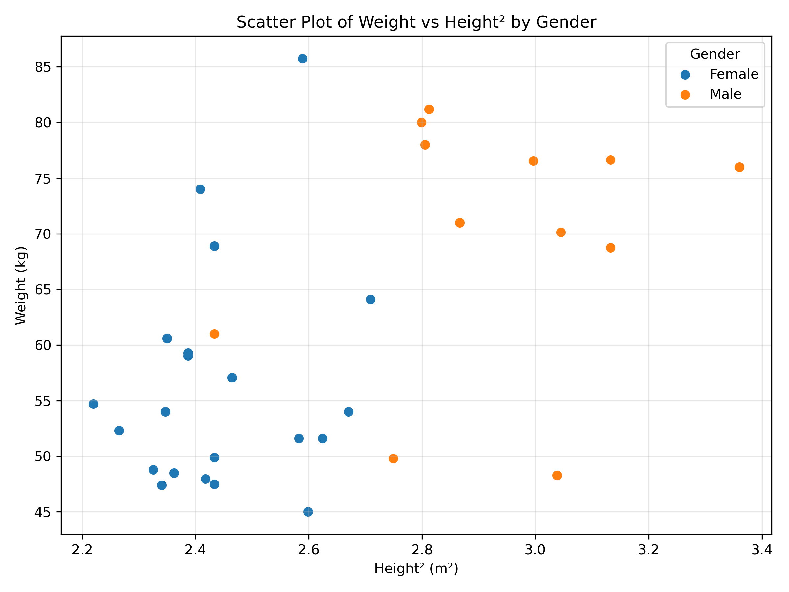

#Question 1

#Create a BMI scatter plot of the weight ( in kg) and height (in square meters). Observe the correlation . Are there any clusters (male, female students) ? 
#Every plot should be accompanied by a 50 word caption explaining the plot.

Libraries/packages like pandas and matplotlib was used.
A plot was generated and an appropriate inference was made. 

Caption - This is a scatter plot illustrating the relationship between weight and squared height (m^2), the two variables used in BMI calculation and observations separated by gender. A positive association is evident, with male students generally occupying higher height^2 and weight values, while female students are concentrated at lower values with some overlap between the groups.

Inference - 
1. The plot shows a clear positive correlation between height and weight, particularly among the male students.
2. The data form 2 groups based on gender.
3. Female students are concentrated largely around 149–165 cm and 45–86 kg.
4. Male students are concentrated largely around 166–183 cm and 48–81 kg.
5. The male group is generally taller and heavier, producing a distinct cluster at higher heights.
6. The female observations show greater vertical spread in weight, including a few relatively high-weight observations despite shorter heights.
7. There is some overlap between the groups, particularly around 155–166 cm and 50–61 kg, so gender cannot be perfectly separated using height and weight alone.
8. One female observation around 161 cm and 86 kg appears separated from the rest of the female observations and may be considered an outlier.

Overall inference -
Height and weight show a positive association, while gender produces a visible separation in the distribution, with males generally occupying the taller/heavier range.
