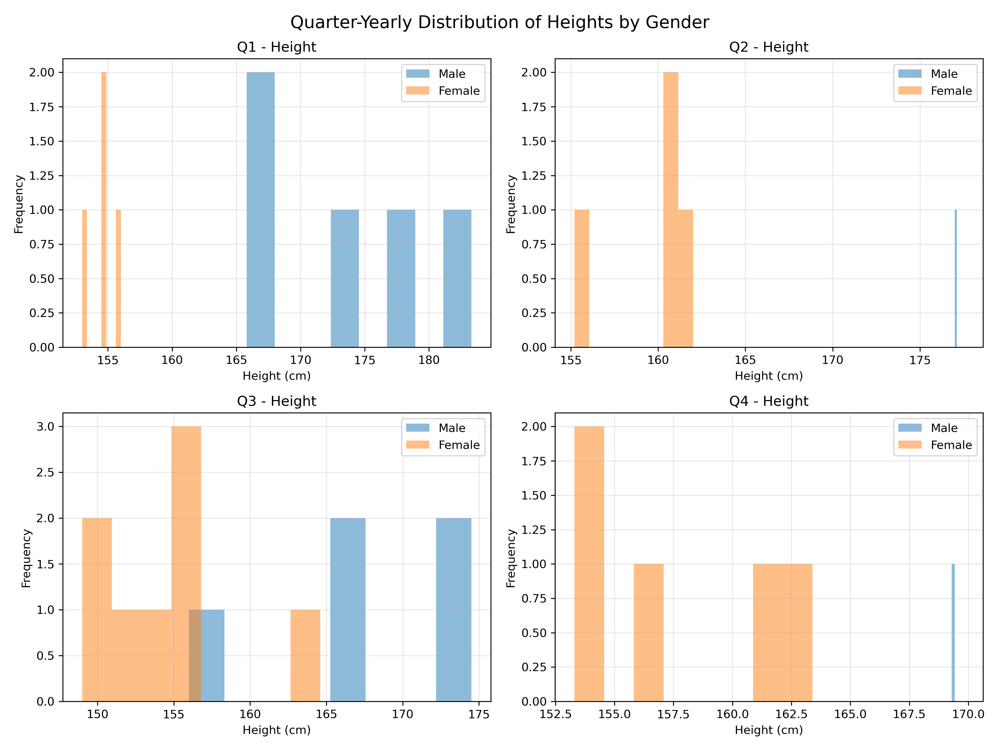
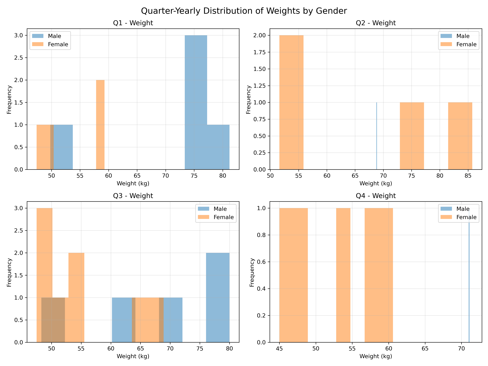

#Question 2

#Create quarter-yearly histogram of heights, weights - overlay the male and female histograms for every quarter.
#Every plot should be accompanied by a 50 word caption explaining the plot.

Libraries/packages like pandas and matplotlib was used.
Appropriate plots were generated for each quarters.

Caption for Q1 - This is a histogram that shows the height distribution of students born during the first quarter, January–March, separated by gender. Female students are predominantly concentrated around 153–157 cm, whereas male students are mainly between 166 and 183 cm. The distributions show considerable separation, with male students generally taller than female students.

Caption for Q2 - This is a histogram that shows the height distribution of students born during the second quarter, April–June, separated by gender. Female students are concentrated mainly around 155–162 cm, while the male observation is approximately 177 cm. The distributions show substantial separation, although the small number of observations limits conclusions about gender-related height patterns.

Caption for Q3 - This is a histogram that shows the height distribution of students born during the third quarter, July–September, separated by gender. Female students are concentrated mainly between 149 and 164 cm, while male students extend approximately from 156 to 174 cm. The distributions overlap around 155–157 cm, although males generally show greater heights.

Caption for Q4 - This is a histogram that shows the height distribution of students born during the fourth quarter, October–December, separated by gender. Female students are mainly distributed between 153 and 163 cm, whereas the male observation is approximately 169 cm. The distributions appear separated, with the male observation being taller, although the sample size is limited.

Caption for Q1 - This is a histogram that shows the weight distribution of students born during the first quarter, January–March, separated by gender. Female students are concentrated mainly between 47 and 59 kg, while male students cluster around 74–81 kg. The distributions are largely separated, indicating higher observed weights among males within this birth-quarter group.

Caption for Q2 - This is a histogram that shows the weight distribution of students born during the second quarter, April–June, separated by gender. Female students display a broad weight range of approximately 52–85 kg, while the male observation is around 69 kg. The considerable overlap and variation suggest that weight distributions are not clearly separated by gender in this birth-quarter group.

Caption for Q3 - This is a histogram that shows the weight distribution of students born during the third quarter, July–September, separated by gender. Female students are concentrated mainly around 48–55 kg, with some observations at higher weights. Male students extend approximately from 48 to 80 kg, showing greater representation at higher weights within this birth-quarter group.

Caption for Q4 - This is a histogram that shows the weight distribution of students born during the fourth quarter, October–December, separated by gender. Female students range approximately from 45 to 60 kg, whereas the male observation is around 71 kg. The distributions appear separated, with the male observation substantially heavier, although only one male observation limits comparison.
