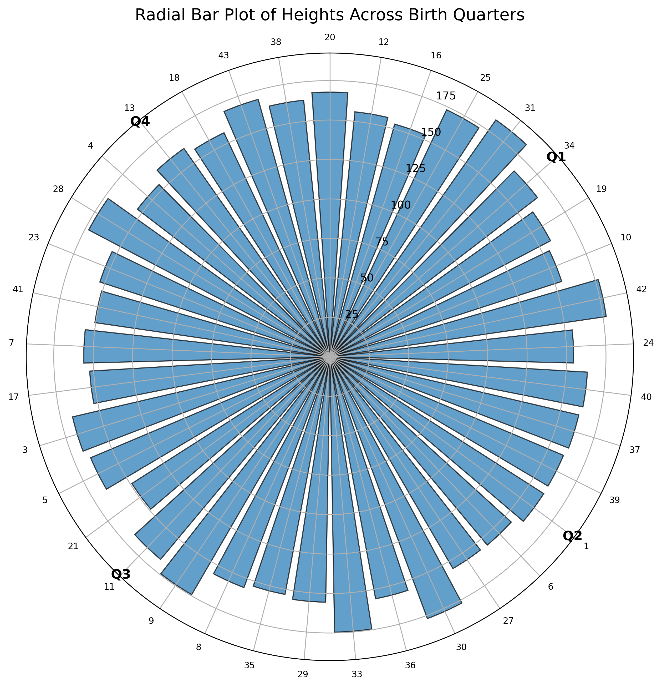

#Question 3

#Create a radial bar plot of the heights across every quarter.
#Every plot should be accompanied by a 50 word caption explaining the plot.

Libraries/packages like pandas and matplotlib was used. An appropriate plots was generated.

Caption - This is a radial bar plot showing individual student heights grouped according to birth quarter where Q1 is for January–March, Q2 is for April–June, Q3 is for July–September, and Q4 is for October–December. Each bar represents one student, with its length corresponding to height. The plot shows substantial individual variation across all birth-quarter groups, with no obvious associated with birth quarter.
