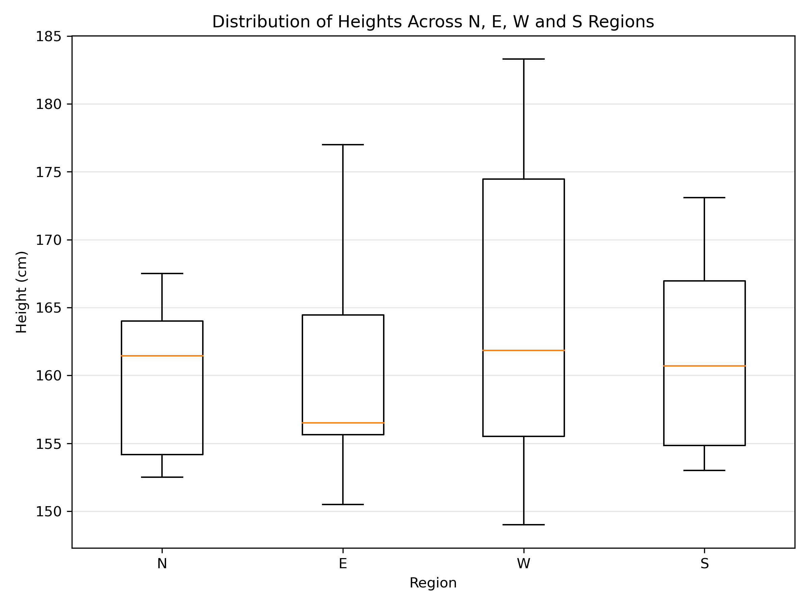

#Question 4

#Create a suitable plot for the heights across N, E, W, S parts of the country - Check if you can infer information from this plot.
#Every plot should be accompanied by a 50 word caption explaining the plot.

Libraries/packages like pandas and matplotlib was used. A plot was generated and an appropriate inference was made.

Caption - This is a boxplot that shows the distribution of student heights across the Northern  (N), Eastern  (E), Western (W), and Southern (S) regions of the country. West shows the greatest height variability and the highest median, while East has the lowest median. North and South show intermediate distributions, with substantial overlap among regional height distributions.

Inference - 
1. West has the greatest variability in height, with the widest overall range of 149–183 cm.
2. East has the lowest median height, approximately 156.5 cm.
3. West has the highest median, approximately 161.8 cm, followed closely by North - around 161.5 cm and South = 160.7 cm.
4. The North, West and South regions have fairly similar median heights, whereas East appears lower.
5. The distributions overlap considerably, so regional differences are not extremely pronounced.
6. No obvious statistical outliers are shown by the boxplot.
7. The plot suggests regional variation in height, but the differences should not be interpreted as statistically significant without an appropriate statistical test.
