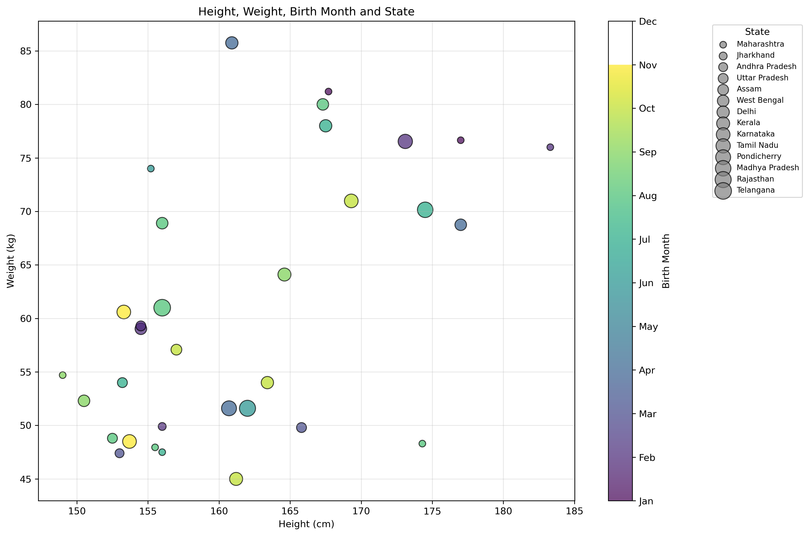

#Question 5

#Visualize all the four parameters - height, weight, month and state in a single plot and make suitable inferences - get creative.
#Every plot should be accompanied by a 50 word caption explaining the plot.

Libraries/packages like pandas and matplotlib was used. A plot was generated and an appropriate inference was made.

Caption - This is a bubble scatter plot that simultaneously visualises student height, weight, birth month, and state. Height and weight are represented on the x- and y-axes, respectively, while birth month is indicated by colour and state by bubble size. A positive height–weight association is evident, with considerable variation and category overlap observed.

Inference - 
1. There is a positive correlation between height and weight where taller students tend to have higher body weights. This relationship is, however, not consistent for every individual.
2. The observations are widely scattered, indicating substantial variation in weight among students of similar height.
3. Birth month does not show any obvious pattern with either height or weight. Students born in different months are distributed across the height–weight range rather than forming distinct month-specific clusters.
4. The plot contains observations from a broad range of heights (149–183 cm) and weights (45–86 kg), demonstrating considerable individual variation.
5. Some students deviate noticeably from the general height–weight trend. For example, an observation around 161 cm and 86 kg has relatively high weight for its height, while some taller students have comparatively low weights (48–50 kg).
6. The state variable also does not show an obvious clustering pattern with height or weight based on bubble size.
7. Bubble size appears to vary across observations, indicating differences in the state/region variable encoded by size. However, there is no obvious visual relationship between bubble size and height or weight.
8. Importantly, this plot does not demonstrate that birth month or state causes differences in height or weight. It only shows the observed distribution. Statistical tests would be required to establish significant associations.
